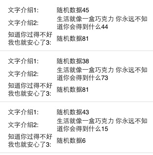

FSTableViewCell
===========

ios自定义类(UIView)代码生成简单的UITableViewCell

Features
========

* 由于一个项目中有大量的UITableViewCell需要书写，样式差不多都是 `文字介绍：显示内容` 这样的。自己又懒得写UITableViewCell类嫌没必要；在方法tableView:cellForRowAtIndexPath中手写又繁琐。就封装变化写了一个UIView类。

* 构思：首先由于`文字介绍`和`显示内容`的宽度固定，然后Cell的一行（Cell可以包括多行）高度就是`文字介绍`和`显示内容`所需要的高度两者相比高一些的。下一行就是高度累加重复；Cell的最上端和最下端给个高度；最下端再画个间隔。

What you need
---

* CommonTableViewCellView.h
* CommonTableViewCellView.m

How to use
---  

```objective-c
- (CGFloat)tableView:(UITableView *)tableView heightForRowAtIndexPath:(NSIndexPath *)indexPath{  
      
    UITableViewCell *cell = [self tableView:tableView cellForRowAtIndexPath:indexPath];  
    CGFloat height = cell.frame.size.height;  
    return height;  
}  
  
- (UITableViewCell *)tableView:(UITableView *)tableView cellForRowAtIndexPath:(NSIndexPath *)indexPath {  
    static NSString *CellIdentifier = @"Cell";  
    UITableViewCell *cell = [tableView dequeueReusableCellWithIdentifier:CellIdentifier];  
    if (cell == nil) {  
        cell = [[[UITableViewCell alloc]initWithStyle:UITableViewCellStyleDefault reuseIdentifier:CellIdentifier ] autorelease];  
          
        UIView *view = [[[UIView alloc] init] autorelease];  
        CGFloat viewHeight = 0.0f;  
        for (int i=0 ; i < 5 ; i++) {  
              
            NSMutableArray *keyArray = [NSMutableArray arrayWithObjects:@"文字介绍1:",@"文字介绍2:",@"知道你过得不好 我也就安心了3:", nil nil];  
            NSMutableArray *valueArray = [NSMutableArray arrayWithObjects:[NSString stringWithFormat:@"随机数据%d", arc4random_uniform(100)],[NSString stringWithFormat:@"生活就像一盒巧克力 你永远不知道你会得到什么%d", arc4random_uniform(100)],[NSString stringWithFormat:@"随机数据%d", arc4random_uniform(100)], nil nil];  
  
            CommonTableViewCellView *cellView = [[[CommonTableViewCellView alloc] initWithFrame:CGRectMake(0, viewHeight, self.view.frame.size.width, 0) keyArray:keyArray valueArray:valueArray] autorelease];  
            viewHeight += cellView.viewHeight;  
            [view addSubview:cellView];  
        }  
        [view setFrame:CGRectMake(0, 0, self.view.frame.size.width, viewHeight)];  
        cell.accessoryView = view;  
        [cell setFrame:CGRectMake(0, 0, self.view.frame.size.width, viewHeight)];  
        cell.selectionStyle = UITableViewCellSelectionStyleNone;  
  
    }  
    return cell;  
}  
    
```
